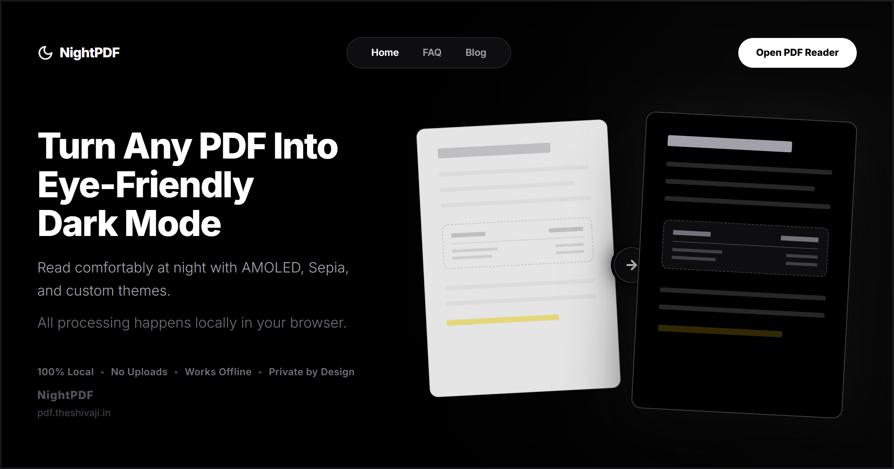

# NightPDF

**Turn Any PDF Into Eye-Friendly Dark Mode**

NightPDF is a privacy-first reading platform that converts bright PDFs into optimized reading experiences directly inside your browser. Built for extended reading sessions, it eliminates eye strain through local processing without ever uploading your documents to a server.

---

## Product Preview

<div align="center">
  
  <p><em>From harsh white to absolute black in milliseconds.</em></p>
</div>

---

## Why NightPDF Exists

Most PDF readers were designed for daylight. They lack proper theming, and the white backgrounds cause significant eye strain during long reading sessions at night. 

While online converters exist, they require uploading sensitive research, books, or proprietary documents to remote servers—introducing major privacy concerns. 

NightPDF solves this by bringing powerful PDF manipulation entirely into the browser via WebAssembly, guaranteeing 100% privacy and offline support.

---

## Core Features

| Feature | Description |
| :--- | :--- |
| **Complete Privacy** | 100% local processing. Files never leave your device. |
| **Dynamic Theming** | AMOLED Black, Sepia, Dark Gray, and Custom Modes. |
| **Eye-Strain Reduction** | Intelligently inverts white backgrounds while preserving images. |
| **Offline Architecture** | Fully functional without an internet connection (PWA Ready). |
| **Universal Support** | Read and export your customized PDFs seamlessly. |
| **Responsive Design** | Optimized reading experience across desktop and mobile. |

---

## Interactive Themes

NightPDF ships with carefully calibrated reading environments:

- **AMOLED Black (#000000):** Maximizes battery life on OLED screens and provides the highest contrast for late-night reading.
- **Sepia:** Emulates physical paper with warm tones, reducing blue light emission for evening study.
- **Dark Gray:** A softer alternative to pure black, offering comfortable contrast without intense extremity.
- **Custom Theme:** Fine-tune background and text hex colors to match your exact visual preference.

---

## Privacy First Architecture

NightPDF was engineered with a fundamental principle: **Your documents are yours.**

* **No Cloud Processing:** We don't have servers that process your PDFs. 
* **Zero Tracking:** We don't track what you read, how long you read, or what you upload.
* **HIPAA/Research Compliant:** Because the processing happens strictly in your browser's local memory, it is safe for medical, legal, and proprietary research documents.

---

## How It Works

1. **Upload PDF** — Drag and drop any PDF into the secure browser environment.
2. **Choose Theme** — Select AMOLED, Sepia, or build your own environment.
3. **Read Comfortably** — Enjoy an optimized, glare-free reading experience.
4. **Export** — Download the permanently themed PDF for offline use anywhere.

---

## Tech Stack

NightPDF is built on a modern, high-performance web stack:

| Layer | Technology |
| :--- | :--- |
| **Framework** | React + Vite |
| **Styling** | Tailwind CSS |
| **Animations** | GSAP (GreenSock) |
| **PDF Engine** | Mozilla PDF.js |
| **Deployment** | Vercel / Edge Network |

---

## Performance

- **Browser-Native:** Runs entirely on the client side using modern Web APIs.
- **Offline Support:** Service workers cache the application for instant loading, even on airplanes.
- **Fast Rendering:** Optimized virtualized rendering ensures 1000+ page documents load smoothly.
- **Zero Backend Dependency:** No API latency, no server downtime, no rate limits.

---

## Installation & Local Development

To run NightPDF locally for development or contribution:

```bash
# Clone the repository
git clone https://github.com/username/nightpdf.git

# Navigate to the frontend directory
cd nightpdf/Frontend

# Install dependencies
npm install

# Start the development server
npm run dev
```

### Build for Production

```bash
# Create an optimized production build
npm run build

# Preview the production build locally
npm run preview
```

---

## Folder Structure

```text
NightPDF/
├── Frontend/
│   ├── public/              # Static assets (Favicons, Service Workers)
│   ├── src/
│   │   ├── components/      # Reusable React UI components
│   │   ├── pages/           # Route-level components (Blog, Legal)
│   │   ├── utils/           # Helper functions & PDF processing logic
│   │   ├── App.jsx          # Main application routing & state
│   │   ├── index.css        # Tailwind directives & global styling
│   │   └── main.jsx         # React application entry point
│   ├── index.html           # HTML template
│   ├── package.json         # Dependencies & scripts
│   ├── tailwind.config.js   # Tailwind design system configuration
│   └── vite.config.js       # Vite build tooling configuration
└── README.md                # Project documentation
```

---

## Roadmap

NightPDF is evolving from a single utility into a comprehensive reading platform:

- [ ] **AI Reading Assistant** — Local LLM integration for context querying.
- [ ] **PDF Notes & Smart Highlights** — Persistent, exportable annotations.
- [ ] **Research Workspace** — Tabbed interface for multi-document workflows.
- [ ] **Reading Analytics** — Local insights into reading velocity and habits.
- [ ] **RAG Knowledge Base** — Connect multiple PDFs into a searchable graph.

---

## Contributing

We welcome contributions from the community. Whether it's a new feature, a bug fix, or a documentation improvement, please feel free to open an issue or submit a pull request.

## License

This project is licensed under the MIT License - see the LICENSE file for details.

---

*Built for students, researchers, developers, and anyone who reads PDFs late into the night.*

## License

NightPDF is source-available software.

You may view, learn from, and modify the code for personal or educational purposes.

Commercial use, redistribution, and rebranding are prohibited.

See LICENSE.md for full details.

